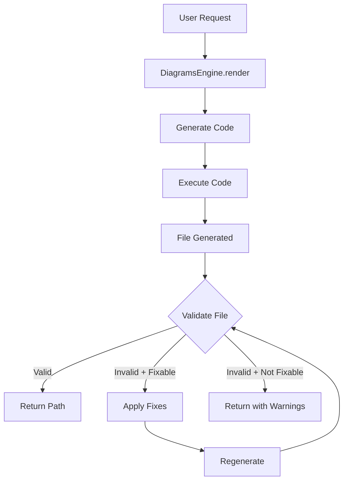

# Diagram Validation and Auto-Fix System

## Overview

Add validation and automatic fixing for generated diagrams to ensure they are usable, properly formatted, and fit within UI viewport constraints. Implementation uses minimal code changes by extending the existing `DiagramsEngine` class.

## Current State

- `DiagramsEngine.render()` generates diagrams and calls `_execute_code()`
- `_execute_code()` checks file existence but doesn't validate quality
- Advisors already enhance `graphviz_attrs` for layout improvements
- No validation for file corruption, empty files, or UI fit issues

## Architecture



## Implementation Plan

### Phase 1: Core Validation (Minimal Changes)

#### 1.1 Add Validation Method to DiagramsEngine

**File:** `backend/src/generators/diagrams_engine.py`

Add `_validate_diagram_file()` method after `_execute_code()` (around line 703):

- **File existence check** (defensive, though already checked)
- **File size validation**: Reject 0-byte files, warn on suspiciously small files
- **Format validation**: Check PNG header (`\x89PNG\r\n\x1a\n`), basic SVG structure
- **UI fit validation**: For PNG, check dimensions against viewport limits (1920x1080 max, 400x300 min)
- **Return format**: `{'is_valid': bool, 'issues': List[str], 'can_fix': bool}`

**Dependencies:** Add `Pillow>=10.0.0` to `requirements.txt` for PNG validation

#### 1.2 Add Fix Method to DiagramsEngine

**File:** `backend/src/generators/diagrams_engine.py`

Add `_fix_diagram_quality()` method after `_validate_diagram_file()`:

- **Input**: `spec: ArchitectureSpec`, `validation_result: Dict`
- **Process**: Deep copy spec, enhance `graphviz_attrs` based on issues:
  - Empty/small files → Increase DPI (150), set size (12,8), add spacing
  - UI fit issues → Adjust size to fit viewport (12,8 at 100dpi)
  - Icon size issues → Increase DPI and canvas size
- **Output**: Modified spec with enhanced attributes
- **Pattern**: Reuse advisor pattern (modify `graphviz_attrs.graph_attr`)

#### 1.3 Integrate Validation into Render Flow

**File:** `backend/src/generators/diagrams_engine.py`

Modify `render()` method (around line 198, after `_execute_code()` call):

```python
# After: output_path = self._execute_code(code, spec.title, spec.outformat)

# Validate diagram
primary_format = spec.outformat[0] if isinstance(spec.outformat, list) else spec.outformat if spec.outformat else 'png'
validation = self._validate_diagram_file(output_path, spec, primary_format)

if not validation['is_valid'] and validation['can_fix']:
    logger.warning(f"[DIAGRAMS_ENGINE] Validation issues: {validation['issues']}")
    logger.info("[DIAGRAMS_ENGINE] Attempting auto-fix...")
    
    # Apply fixes and regenerate
    fixed_spec = self._fix_diagram_quality(spec, validation)
    resolver = ComponentResolver(primary_provider=fixed_spec.provider)
    fixed_code = self._generate_code(fixed_spec, resolver)
    output_path = self._execute_code(fixed_code, fixed_spec.title, fixed_spec.outformat)
    
    # Re-validate
    validation = self._validate_diagram_file(output_path, fixed_spec, primary_format)
    if validation['is_valid']:
        logger.info("[DIAGRAMS_ENGINE] Diagram fixed successfully")
    else:
        logger.warning(f"[DIAGRAMS_ENGINE] Still has issues: {validation['issues']}")
```

**Key Points:**

- Single retry attempt (can be made configurable later)
- Logs validation issues and fix attempts
- Falls back gracefully if fix fails

### Phase 2: Feature Flag Support (Optional)

**File:** `backend/config/features.yaml`

Add feature flags:

```yaml
ENABLE_DIAGRAM_VALIDATION: true
ENABLE_DIAGRAM_AUTO_FIX: true
```

**File:** `backend/src/generators/diagrams_engine.py`

Wrap validation/fix logic in feature flag check:

```python
from ..config.features import get_feature_flags
feature_flags = get_feature_flags()
if feature_flags.get('ENABLE_DIAGRAM_VALIDATION', True):
    # validation logic
```

## Code Changes Summary

| File | Changes | Lines Added | Complexity |

|------|---------|-------------|------------|

| `backend/src/generators/diagrams_engine.py` | Add 2 methods, modify 1 method | ~105 lines | Low |

| `backend/requirements.txt` | Add Pillow dependency | 1 line | Low |

| `backend/config/features.yaml` | Add feature flags (optional) | 2 lines | Low |

**Total:** ~108 lines across 2-3 files

## Validation Checks Implemented

1. **File Validity**

   - Empty file detection (0 bytes)
   - Corrupted PNG header detection
   - Minimum file size check

2. **UI Fit**

   - Maximum dimensions: 1920x1080px
   - Minimum dimensions: 400x300px
   - Aspect ratio warnings (extreme ratios)

3. **Icon Size** (heuristic)

   - Estimated icon size based on component count
   - Warns if icons likely too small/large

## Auto-Fix Strategies

1. **Empty/Small Files**

   - Increase DPI: 96 → 150
   - Set canvas size: 12x8 inches
   - Add spacing: nodesep=1.0, ranksep=1.5

2. **UI Fit Issues**

   - Adjust size to fit viewport: 12x8 at 100dpi (~1200x800px)
   - Maintain aspect ratio considerations

3. **Icon Size Issues**

   - Increase DPI for better icon clarity
   - Increase canvas size for more space

## Future Enhancements (Not in Phase 1)

### Phase 3: Advanced Quality Validation (Future)

1. **Icon Correctness Validation**

   - Parse generated code to extract component classes
   - Compare against spec to verify correct icons used
   - Requires code parsing logic

2. **Connection Validation**

   - Parse generated code to extract connections
   - Verify all spec connections present
   - Check connection directions match spec

3. **Visual Quality Scoring**

   - Image analysis for overlapping elements
   - Text readability checks
   - Layout quality metrics

4. **Component Completeness**

   - Verify all spec components rendered
   - Check for missing components in generated diagram

## Testing Strategy

1. **Unit Tests**

   - Test `_validate_diagram_file()` with various file states
   - Test `_fix_diagram_quality()` with different issue types
   - Mock file system for edge cases

2. **Integration Tests**

   - Generate diagram → validate → fix → re-validate flow
   - Test with empty files, corrupted files, oversized diagrams

3. **Manual Testing**

   - Generate diagrams with various component counts
   - Verify UI fit for different diagram sizes
   - Check logs for validation messages

## Risk Mitigation

1. **Performance**: Validation adds minimal overhead (file I/O, basic image check)
2. **False Positives**: Log warnings but don't block valid diagrams
3. **Fix Failures**: Gracefully fall back to original diagram if fix fails
4. **Dependencies**: Pillow is lightweight and commonly used

## Success Criteria

- Empty/corrupted files detected and fixed automatically
- Oversized diagrams adjusted to fit UI viewport
- Small diagrams enhanced for better icon visibility
- No breaking changes to existing API
- Feature flag support for gradual rollout