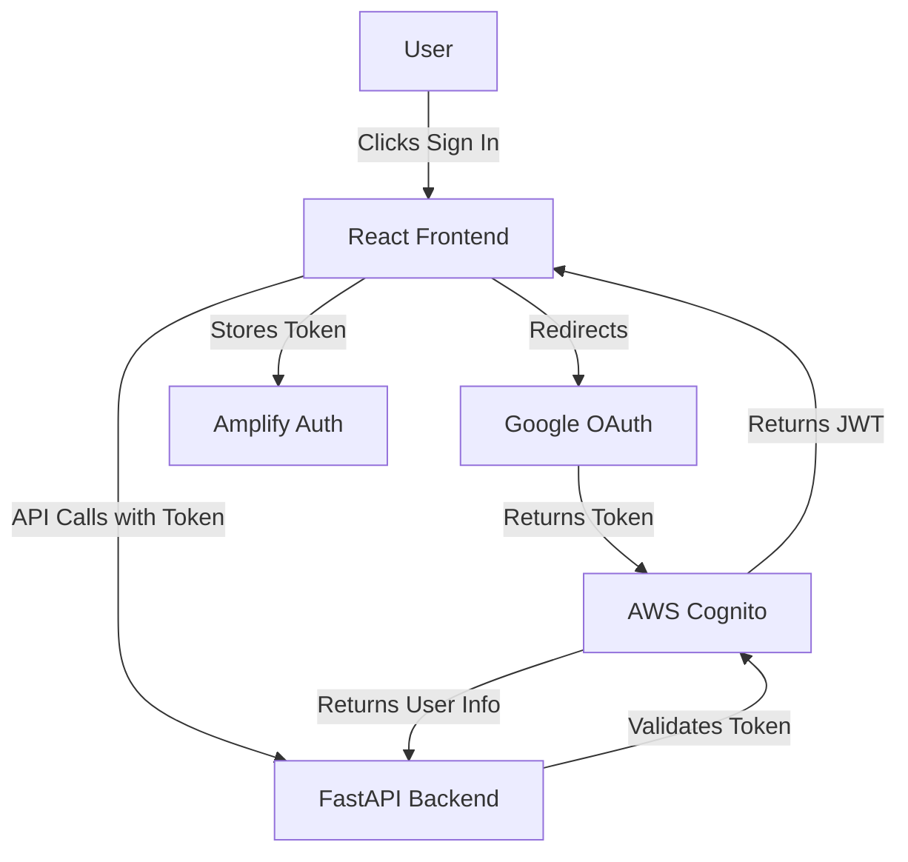

# Add Google Authentication with AWS Amplify

## Overview

Implement Google authentication using AWS Amplify and Cognito. Authentication will be optional - users can use the app without signing in, but authenticated users will have access to enhanced features (e.g., saving diagrams, history).

## Architecture



## Implementation Steps

### 1. AWS Cognito Setup (Manual - One-time)

**Create Cognito User Pool:**

- AWS Console → Cognito → Create User Pool
- Sign-in options: Email, Google (federated identity)
- App client: Enable "Generate client secret" = false (for Amplify)
- Domain: Create Cognito domain (e.g., `your-app-name`)
- Google provider: Configure with Google OAuth credentials

**Google OAuth Setup:**

- Google Cloud Console → Create OAuth 2.0 credentials
- Authorized redirect URIs: `https://your-cognito-domain.auth.region.amazoncognito.com/oauth2/idpresponse`
- Copy Client ID and Client Secret

**Cognito Configuration:**

- Identity providers → Google → Add Client ID and Secret
- Attribute mapping: Map Google email → Cognito email
- App client settings: Enable Google provider, set callback URLs

### 2. Frontend Dependencies

**Install AWS Amplify packages:**

- `aws-amplify` - Core Amplify library
- `@aws-amplify/ui-react` - Pre-built auth components (optional, for quick UI)

**Files to modify:**

- `frontend/package.json` - Add dependencies
- `frontend/src/main.tsx` - Configure Amplify
- `frontend/src/App.tsx` - Add auth context and protected routes

### 3. Amplify Configuration

**Create configuration file:**

- `frontend/src/config/amplify.ts` - Amplify configuration with Cognito settings
- Load Cognito settings from environment variables (`.env.local`)

**Environment variables needed:**

- `VITE_AWS_REGION` - AWS region (e.g., `us-east-1`)
- `VITE_COGNITO_USER_POOL_ID` - User Pool ID
- `VITE_COGNITO_CLIENT_ID` - App Client ID
- `VITE_COGNITO_DOMAIN` - Cognito domain (optional, for hosted UI)

### 4. Authentication Components

**Create authentication components:**

- `frontend/src/components/Auth/LoginButton.tsx` - Sign in button
- `frontend/src/components/Auth/LogoutButton.tsx` - Sign out button
- `frontend/src/components/Auth/UserProfile.tsx` - Display user info (optional)
- `frontend/src/hooks/useAuth.ts` - Custom hook for auth state

**Features:**

- Sign in with Google (hosted UI or custom flow)
- Sign out functionality
- Display user email/name when authenticated
- Show login button when not authenticated

### 5. Authentication Context

**Create auth context:**

- `frontend/src/contexts/AuthContext.tsx` - React context for auth state
- Provides: `user`, `isAuthenticated`, `signIn`, `signOut`, `loading`
- Wrap App component with AuthProvider

### 6. Backend Token Validation (Optional)

Since authentication is optional, backend validation will be:

- **Optional middleware** - Validate JWT if Authorization header present
- **User context** - Extract user info from token for authenticated requests
- **Feature flag** - Enable/disable auth requirement per endpoint

**Files to modify:**

- `backend/main.py` - Add optional JWT validation middleware
- `backend/src/services/auth.py` - JWT validation utility (new file)
- `backend/src/api/routes.py` - Optional auth decorator for endpoints

### 7. Feature Flag

**Add authentication feature flag:**

- `config/features.yaml` - Add `google_auth: true`
- Frontend checks flag before showing auth UI
- Backend checks flag before enforcing auth (if needed)

### 8. UI Integration

**Update App.tsx:**

- Add auth buttons to header (Login/Logout, User profile)
- Conditionally show authenticated features
- Keep existing functionality available without auth

**Update header:**

- Show "Sign In" button when not authenticated
- Show user email/name and "Sign Out" when authenticated
- Position: Right side of header, next to navigation links

### 9. API Integration

**Update API client:**

- `frontend/src/services/api.ts` - Add Authorization header when user is authenticated
- Include JWT token in API requests: `Authorization: Bearer {token}`

### 10. Documentation

**Update documentation:**

- `README.md` - Add authentication setup instructions
- `docs/ARCHITECTURE.md` - Document auth flow
- `docs/DECISIONS.md` - Add ADR for authentication approach

## Files to Create

1. `frontend/src/config/amplify.ts` - Amplify configuration
2. `frontend/src/contexts/AuthContext.tsx` - Auth context provider
3. `frontend/src/hooks/useAuth.ts` - Auth hook
4. `frontend/src/components/Auth/LoginButton.tsx` - Login component
5. `frontend/src/components/Auth/LogoutButton.tsx` - Logout component
6. `frontend/src/components/Auth/UserProfile.tsx` - User profile component
7. `backend/src/services/auth.py` - JWT validation utility (optional)

## Files to Modify

1. `frontend/package.json` - Add Amplify dependencies
2. `frontend/src/main.tsx` - Configure Amplify
3. `frontend/src/App.tsx` - Add auth UI and context
4. `frontend/src/services/api.ts` - Add auth headers
5. `backend/main.py` - Add optional JWT middleware
6. `config/features.yaml` - Add auth feature flag
7. `README.md` - Add setup instructions

## Environment Variables

**Frontend (.env.local):**

```
VITE_AWS_REGION=us-east-1
VITE_COGNITO_USER_POOL_ID=us-east-1_XXXXXXXXX
VITE_COGNITO_CLIENT_ID=xxxxxxxxxxxxxxxxxxxxxxxxxx
VITE_COGNITO_DOMAIN=your-app-name.auth.us-east-1.amazoncognito.com
```

**Backend (.env):**

```
AWS_REGION=us-east-1
COGNITO_USER_POOL_ID=us-east-1_XXXXXXXXX
COGNITO_CLIENT_ID=xxxxxxxxxxxxxxxxxxxxxxxxxx
```

## Testing Strategy

1. **Manual Testing:**

   - Sign in with Google
   - Verify token stored in Amplify
   - Verify API calls include Authorization header
   - Sign out and verify token cleared

2. **Edge Cases:**

   - Token expiration handling
   - Network errors during sign-in
   - Invalid tokens in API requests

## Security Considerations

- JWT tokens stored securely by Amplify (not in localStorage)
- HTTPS required for production (Cognito requirement)
- CORS configured to allow Cognito domain
- Token validation on backend (if auth required)

## Rollout Plan

1. **Phase 1:** Setup Cognito and Google OAuth (manual)
2. **Phase 2:** Frontend Amplify integration (code)
3. **Phase 3:** UI components and context (code)
4. **Phase 4:** Backend token validation (optional, code)
5. **Phase 5:** Testing and documentation

## Notes

- Authentication is **optional** - existing functionality remains available without sign-in
- Cognito setup is manual (one-time AWS Console configuration)
- Google OAuth credentials must be created in Google Cloud Console
- Feature flag allows easy enable/disable of auth features
- Backend validation is optional since auth is optional