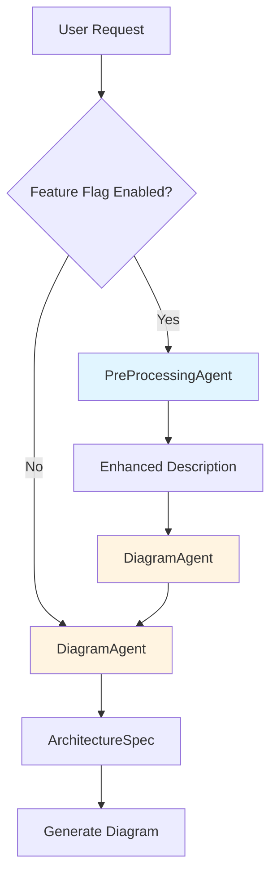

# Hybrid Multi-Agent Pipeline Implementation Plan

## Overview

Implement a 2-stage hybrid pipeline that adds a Pre-Processing Agent before the existing Diagram Agent to better handle vague requirements. The pipeline will be feature-flagged for gradual rollout.

## Architecture



## Implementation Steps

### Phase 1: Create Pre-Processing Agent

**File: `backend/src/agents/pre_processing_agent.py`** (NEW)

- Create `RequirementAnalysis` Pydantic model with:
  - `enhanced_description`: Enhanced description string
  - `vague_terms_resolved`: Dict mapping vague terms to specific components
  - `detected_patterns`: List of architecture patterns
  - `suggested_components`: List of component node_ids
  - `architectural_hints`: Guidance text
  - `confidence`: Float (0.0 to 1.0)

- Create `PreProcessingAgent` class:
  - Initialize with provider (aws/azure/gcp)
  - Use same Bedrock model configuration as DiagramAgent
  - Load registry for available components
  - Generate system prompt with:
    - Available components list (from registry)
    - Vague term resolution rules (database → rds/dynamodb, compute → ec2/lambda, etc.)
    - Pattern detection guidelines
    - Business problem analysis rules
  - `analyze(description: str) -> RequirementAnalysis` method:
    - Call Strands Agent with structured output
    - Validate suggested components against registry
    - Return RequirementAnalysis

**Key Features:**

- Resolves vague terms: "database" → "rds" or "dynamodb" based on context
- Detects patterns: serverless, microservices, event-driven
- Suggests components based on industry/challenges
- Provides architectural hints for diagram generation

### Phase 2: Create Two-Stage Pipeline Orchestrator

**File: `backend/src/agents/two_stage_pipeline.py`** (NEW)

- Create `TwoStagePipeline` class:
  - Initialize with `max_iterations` parameter (default: 1, no loop)
  - Cache PreProcessingAgent instances per provider (lazy initialization)
  - Reuse existing `DiagramAgent` instance

- Implement `generate_spec(description: str, provider: Optional[str] = None) -> Tuple[ArchitectureSpec, Dict]`:
  - **Stage 1: Pre-Processing**
    - Get or create PreProcessingAgent for provider
    - Call `pre_agent.analyze(description)`
    - Build enhanced description from analysis
  - **Stage 2: Diagram Generation**
    - Call existing `diagram_agent.generate_spec(enhanced_description, provider)`
    - Return spec and metadata (pre-processing analysis results)

- Helper method `_build_enhanced_description(description: str, analysis: RequirementAnalysis) -> str`:
  - Combine original description with resolved vague terms
  - Add detected patterns
  - Add suggested components
  - Add architectural hints

**Integration Points:**

- Reuses `DiagramAgent` class (no changes needed)
- Uses `DiagramAgent.classifier` for provider detection
- Returns same `ArchitectureSpec` format

### Phase 3: Add Feature Flag

**File: `config/features.yaml`** (UPDATE)

Add new feature flag:

```yaml
features:
  # ... existing flags ...
  pre_processing_pipeline: false  # Phase 5: Pre-processing agent pipeline
```

**File: `backend/src/api/routes.py`** (UPDATE)

- Import feature flag loader (check how other features are loaded)
- Add conditional logic in `generate_diagram()` endpoint:
  ```python
  # After line 235 (MCP status check)
  use_pipeline = features.get("pre_processing_pipeline", False)
  
  if use_pipeline:
      from ..agents.two_stage_pipeline import TwoStagePipeline
      pipeline = TwoStagePipeline()
      spec, pipeline_metadata = pipeline.generate_spec(
          request.description, 
          provider=request.provider
      )
      logger.info(f"[{request_id}] Pipeline metadata: {pipeline_metadata}")
  else:
      # Existing code (line 241)
      spec = agent.generate_spec(request.description, provider=request.provider)
  ```


**Note:** Need to check how feature flags are loaded in routes.py (may need to import from config)

### Phase 4: Update Module Exports

**File: `backend/src/agents/__init__.py`** (UPDATE)

Add exports:

```python
from .pre_processing_agent import PreProcessingAgent, RequirementAnalysis
from .two_stage_pipeline import TwoStagePipeline

__all__ = [
    # ... existing exports ...
    "PreProcessingAgent",
    "RequirementAnalysis",
    "TwoStagePipeline",
]
```

### Phase 5: Add Unit Tests

**File: `backend/tests/test_pre_processing_agent.py`** (NEW)

- Test `PreProcessingAgent.analyze()`:
  - Test vague term resolution ("database" → "rds")
  - Test pattern detection ("serverless" pattern)
  - Test component suggestions
  - Test confidence scoring
  - Test error handling

**File: `backend/tests/test_two_stage_pipeline.py`** (NEW)

- Test `TwoStagePipeline.generate_spec()`:
  - Test pre-processing integration
  - Test enhanced description building
  - Test DiagramAgent reuse
  - Test metadata generation
  - Test feature flag integration (mock)

**File: `backend/tests/test_api.py`** (UPDATE)

- Add test for feature flag behavior:
  - Test with flag enabled
  - Test with flag disabled
  - Verify same output format

### Phase 6: Error Handling & Logging

**PreProcessingAgent:**

- Log analysis results (vague terms resolved, patterns detected)
- Handle agent errors gracefully (return minimal analysis)
- Validate components against registry

**TwoStagePipeline:**

- Log pipeline execution (pre-processing results, metadata)
- Handle pre-processing failures (fallback to direct DiagramAgent)
- Track performance metrics

### Phase 7: Documentation

**File: `docs/ARCHITECTURE.md`** (UPDATE)

Add section on Multi-Agent Pipeline:

- Architecture diagram
- Flow description
- Feature flag usage
- Performance considerations

**File: `docs/DECISIONS.md`** (UPDATE)

Add ADR for Multi-Agent Pipeline:

- Decision: Use 2-stage hybrid pipeline
- Rationale: Better vague requirement handling without full post-processing overhead
- Trade-offs: 2x cost/latency vs improved quality
- Alternatives considered: Full pipeline, single enhanced agent

## File Changes Summary

### New Files:

1. `backend/src/agents/pre_processing_agent.py` - Pre-processing agent implementation
2. `backend/src/agents/two_stage_pipeline.py` - Pipeline orchestrator
3. `backend/tests/test_pre_processing_agent.py` - Pre-processing agent tests
4. `backend/tests/test_two_stage_pipeline.py` - Pipeline tests

### Modified Files:

1. `config/features.yaml` - Add `pre_processing_pipeline` feature flag
2. `backend/src/api/routes.py` - Add conditional pipeline usage (lines ~235-241)
3. `backend/src/agents/__init__.py` - Export new classes
4. `backend/tests/test_api.py` - Add feature flag tests
5. `docs/ARCHITECTURE.md` - Document pipeline architecture
6. `docs/DECISIONS.md` - Add ADR for pipeline decision

### Unchanged Files:

- `backend/src/agents/diagram_agent.py` - No changes needed (reused as-is)
- `backend/src/agents/classifier_agent.py` - No changes needed
- `backend/src/generators/universal_generator.py` - No changes needed

## Testing Strategy

1. **Unit Tests:**

   - PreProcessingAgent: Test vague term resolution, pattern detection
   - TwoStagePipeline: Test orchestration, enhanced description building
   - Feature flag: Test enable/disable behavior

2. **Integration Tests:**

   - End-to-end: User request → Pre-processing → Diagram → Response
   - Compare outputs: Pipeline vs direct DiagramAgent
   - Verify metadata in responses

3. **Manual Testing:**

   - Test with vague requirements: "I need a database and compute"
   - Test with business problems: "E-commerce company with traffic spikes"
   - Test with clear requirements: "API Gateway, Lambda, DynamoDB"
   - Verify feature flag toggle works

## Rollout Strategy

1. **Development:**

   - Implement with feature flag disabled (`pre_processing_pipeline: false`)
   - Test thoroughly in development environment

2. **Staging:**

   - Enable feature flag for testing
   - Monitor performance (latency, cost)
   - Compare quality metrics

3. **Production:**

   - Gradual rollout: Enable for percentage of requests
   - Monitor error rates and user feedback
   - Full rollout if metrics are positive

## Success Metrics

- **Quality:** Improved component resolution for vague requirements
- **Performance:** Latency increase < 3 seconds (acceptable)
- **Cost:** 2x cost increase (expected and acceptable)
- **Error Rate:** No increase in errors
- **User Satisfaction:** Better diagram quality for vague inputs

## Risk Mitigation

1. **Pre-processing failures:** Fallback to direct DiagramAgent
2. **Cost increase:** Feature flag allows instant rollback
3. **Latency increase:** Monitor and optimize prompts if needed
4. **Component validation:** Validate all suggestions against registry

## Future Enhancements (Out of Scope)

- Post-processing agent for validation/refinement
- Iterative refinement loop
- Conditional pipeline (only for vague requirements)
- Caching of pre-processing results