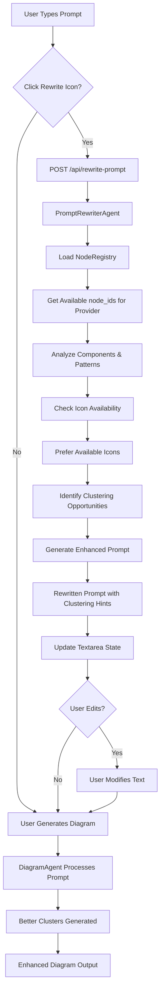

# Prompt Rewriting Feature with Clustering Support

## Overview

Add an optional prompt rewriting feature that transforms user prompts into structured, clear descriptions with clustering guidance for better architecture diagram generation. The feature includes a sparkle icon in the textarea that users can click to enhance their prompts with component grouping hints.

## Architecture Flow



## Key Enhancements

### Clustering Guidance

The rewritten prompt will include explicit hints about component groupings that help DiagramAgent create better clusters:

1. **Pattern Detection**: Identify architectural patterns (event-driven, data pipeline, microservices, serverless, network/VPC)
2. **Component Grouping**: Suggest which components should be grouped together
3. **Layer Identification**: Identify architectural layers (Frontend/Edge, Network, Compute, Data, Integration)
4. **Cluster Suggestions**: Provide clustering hints that DiagramAgent can use when generating ArchitectureSpec

### Icon Availability Check (Silent)

The agent silently checks available icons and prefers them when rewriting prompts:

1. **Registry Lookup**: Load NodeRegistry and get available node_ids for the provider
2. **Component Matching**: Compare user's mentioned components against available icons
3. **Silent Substitution**: Replace unavailable components with available alternatives when possible
4. **No User Notification**: This happens automatically without alerting the user (silent check)
5. **Better Success Rate**: Ensures rewritten prompts use components that will successfully resolve during diagram generation

## Implementation Steps

### 1. Backend: Create PromptRewriterAgent

**File**: `backend/src/agents/prompt_rewriter_agent.py` (NEW)

- Follow same pattern as `ClassifierAgent` and `DiagramAgent`
- Use Strands Agents with BedrockModel (same model config)
- System prompt focuses on:
  - Structuring prompts for clarity
  - Identifying architectural patterns
  - Suggesting component groupings/clusters
  - Providing clustering hints for DiagramAgent
  - **Preferring available icons/components** (silent check)
- Method: `rewrite(description: str, provider: str) -> Dict`
- Returns: `{"rewritten_description": str, "improvements": List[str], "components_identified": List[str], "suggested_clusters": List[Dict]}`
- `suggested_clusters` format: `[{"name": "Frontend Layer", "components": ["api", "cdn"], "pattern": "serverless"}, ...]`

**Icon Availability Check (Silent)**:

- Initialize `NodeRegistry` instance in `__init__` method
- Use `registry.get_node_list(provider)` to get list of available node_ids for the provider
- Pass available node_ids to agent in system prompt or user prompt context
- Agent silently prefers components that match available node_ids when rewriting
- If user mentions a component not in registry, agent suggests closest available alternative
- This check happens automatically without user notification (silent)
- Example: If user says "AppSync" but it's not in AWS registry, agent suggests "API Gateway" or "Lambda" as alternatives

**System Prompt Strategy**:

The agent should analyze the prompt and:

1. **Check icon availability**: Compare mentioned components against available node_ids from registry
2. Identify all components mentioned (preferring available icons)
3. Detect architectural pattern (event-driven, data pipeline, microservices, serverless, network/VPC)
4. Group components by architectural layers:

   - Frontend/Edge: Route53, CloudFront, WAF, API Gateway
   - Network: VPC, Subnets, Internet Gateway, NAT Gateway
   - Compute: EC2, Lambda, ECS, EKS
   - Data: RDS, DynamoDB, S3, ElastiCache
   - Integration: SQS, SNS, EventBridge

5. Suggest clusters based on pattern and layer groupings
6. Rewrite prompt to include clustering hints (e.g., "Group API Gateway and CloudFront in Frontend Layer", "Group Lambda functions in Compute Layer")
7. **Silently replace unavailable components** with available alternatives when possible

**Key Points**:

- Reuse existing BedrockModel configuration from env vars
- Use same logging pattern with request context
- Parse JSON response from agent (similar to ClassifierAgent)
- Handle errors gracefully with fallback to original prompt
- Include clustering hints in rewritten description that DiagramAgent can interpret
- **Initialize NodeRegistry** to check available icons (silent, no user notification)
- **Pass available node_ids** to agent so it can prefer them when rewriting
- **Do not Silently substitute** unavailable components with available alternatives

### 2. Backend: Add API Endpoint

**File**: `backend/src/api/routes.py` (MODIFY)

- Add new endpoint: `POST /api/rewrite-prompt`
- Request model: `RewritePromptRequest` (description, provider)
- Response model: `RewritePromptResponse` (rewritten_description, improvements, components_identified, suggested_clusters)
- Initialize `PromptRewriterAgent` at module level (same pattern as `DiagramAgent`)
- Use request ID tracking (existing middleware)
- Error handling with HTTPException (same pattern as other endpoints)

**Location**: Add after existing request/response models, before `@router.post("/generate-diagram")`

**Response Model**:

```python
class SuggestedCluster(BaseModel):
    name: str
    components: List[str]
    pattern: Optional[str] = None  # "event-driven", "data-pipeline", etc.

class RewritePromptResponse(BaseModel):
    rewritten_description: str
    improvements: List[str]
    components_identified: List[str]
    suggested_clusters: List[SuggestedCluster]
```

### 3. Frontend: Add API Client Function

**File**: `frontend/src/services/api.ts` (MODIFY)

- Add `rewritePrompt(description: string, provider: string)` function
- Follow same pattern as `generateDiagram()` function
- Use same error handling with request ID tracking
- TypeScript interfaces: `RewritePromptRequest`, `RewritePromptResponse`, `SuggestedCluster`

### 4. Frontend: Create PromptRewriter Component

**File**: `frontend/src/components/PromptRewriter.tsx` (NEW)

- React functional component with TypeScript
- Props: `description`, `provider`, `onRewrite`, `disabled`
- Icon: Sparkles/magic wand SVG (positioned absolute top-right)
- States: `isRewriting`, `error`
- Only show icon when `description.trim().length > 0`
- Loading state: Spinning animation
- Error state: Tooltip with error message
- Click handler: Calls API, updates parent via `onRewrite` callback
- Optionally display clustering suggestions in a tooltip or info panel (future enhancement)

**Styling**:

- Position: `absolute top-2 right-2`
- Icon size: 20x20px
- Hover: Blue color transition
- Disabled: Opacity 50%, no cursor pointer

### 5. Frontend: Integrate into DiagramGenerator

**File**: `frontend/src/components/DiagramGenerator.tsx` (MODIFY)

- Wrap textarea in `relative` positioned div
- Add `pr-10` padding to textarea (right padding for icon)
- Import and add `<PromptRewriter>` component
- Pass props: `description`, `selectedProvider`, `onRewrite={(rewritten) => setDescription(rewritten)}`, `disabled={isGenerating}`
- Location: Inside the natural-language mode section, around line 310-322

**Important**: The rewritten prompt is fully editable. When `onRewrite` updates `description` state via `setDescription(rewritten)`, the textarea content is updated but remains a normal editable input. Users can:

- Continue typing after rewrite
- Delete/modify the rewritten text
- Click rewrite again to regenerate
- Proceed to generate diagram with rewritten or edited text

### 6. Icon Availability Check Implementation

**How It Works**:

1. **Initialization**:
   ```python
   from ..models.node_registry import get_registry
   
   def __init__(self):
       # ... existing initialization ...
       self.registry = get_registry()
   ```

2. **Get Available Icons**:
   ```python
   def rewrite(self, description: str, provider: str) -> Dict:
       # Get available node_ids for provider
       available_nodes = self.registry.get_node_list(provider)
       # Also get node descriptions for better matching
       all_nodes = self.registry.get_all_nodes(provider)
   ```

3. **Pass to Agent**:

   - Include available node_ids in system prompt or user prompt context
   - Format: "Available components for {provider}: {list of node_ids}"
   - Agent uses this list to prefer available components when rewriting

4. **Silent Substitution Logic**:

   - If user mentions "AppSync" but it's not in AWS registry
   - Agent checks available nodes and finds closest match (e.g., "api_gateway" or "lambda")
   - Agent silently replaces in rewritten prompt without user notification
   - Example: "API Gateway" → "API Gateway" (if api_gateway is available)
   - Example: "AppSync" → "API Gateway" (if AppSync not available, api_gateway is)

5. **Error Handling**:

   - If registry fails to load, continue without icon check (graceful degradation)
   - Log warning but don't fail the rewrite operation
   - Still provide clustering guidance even if icon check fails

**Benefits**:

- Rewritten prompts use components that will successfully resolve
- Reduces diagram generation errors due to unavailable icons
- Improves user experience by ensuring working diagrams
- Silent operation doesn't interrupt user workflow

### 7. Clustering Enhancement Details

**How Clustering Hints Work**:

The rewritten prompt will include natural language hints that DiagramAgent's system prompt can interpret:

- Example: "Create a serverless architecture with API Gateway, CloudFront, three Lambda functions, and DynamoDB. Group API Gateway and CloudFront in the Frontend Layer. Group the Lambda functions in the Compute Layer."

- Example: "Build an event-driven architecture with S3, EventBridge, two Lambda functions, and DynamoDB. Group S3 in Event Sources cluster. Group Lambda functions in Event Processing cluster. Group DynamoDB in Event Storage cluster."

**Pattern-Specific Clustering**:

- **Event-Driven**: "Event Sources", "Event Processing", "Event Storage"
- **Data Pipeline**: "Data Sources", "Processing Layer", "Storage Layer", "Analytics Layer"
- **Microservices**: "API Layer", "Service Layer", "Data Layer"
- **Serverless**: "API Layer", "Compute Layer", "Data Layer"
- **Network/VPC**: "Public Layer", "Private Layer", "Data Layer" (with nested VPC → Subnets → Resources)

### 7. Error Handling & Edge Cases

**Backend**:

- Empty prompt: Return error (shouldn't happen - icon hidden)
- Very long prompt: Handle gracefully (truncate if needed)
- API failure: Return original prompt with error message
- Invalid JSON response: Fallback to original prompt
- No clustering opportunities: Still rewrite for clarity, return empty suggested_clusters

**Frontend**:

- Show error tooltip below icon
- Keep original text if rewrite fails
- Disable icon during generation
- Handle network errors gracefully

## File Changes Summary

**New Files**:

- `backend/src/agents/prompt_rewriter_agent.py` - Agent for rewriting prompts with clustering guidance
- `frontend/src/components/PromptRewriter.tsx` - UI component

**Modified Files**:

- `backend/src/api/routes.py` - Add endpoint and models (including SuggestedCluster)
- `frontend/src/services/api.ts` - Add API client function and TypeScript interfaces
- `frontend/src/components/DiagramGenerator.tsx` - Integrate component

## Testing Considerations

- Test with various prompt lengths (short, medium, long)
- Test with different providers (AWS, Azure, GCP)
- Test with different architectural patterns (event-driven, data pipeline, microservices, serverless, network/VPC)
- Test error scenarios (API failure, network error)
- Test UI states (loading, error, success)
- Verify rewritten prompts generate better clusters when used in generate-diagram
- Verify clustering hints are properly interpreted by DiagramAgent
- Test with prompts that already have good structure vs. unstructured prompts
- Test icon availability check: prompts with unavailable components should be silently corrected
- Verify available icons are preferred when rewriting prompts
- Test with different providers to ensure provider-specific icon availability is checked

## User Experience Flow

1. User types prompt in textarea
2. Sparkle icon appears in top-right corner
3. User clicks icon → Loading spinner shows
4. Rewritten prompt replaces textarea content with clustering hints embedded
5. **User can edit the rewritten prompt** (add, delete, modify)
6. User can click rewrite again OR proceed to generate diagram
7. Generate button works with rewritten/edited text
8. DiagramAgent processes enhanced prompt and generates better clusters
9. Resulting diagram has improved visual organization

## Success Criteria

- Icon appears in textarea top-right corner when text is present
- Clicking icon rewrites prompt and updates textarea with clustering hints
- Loading state shows during rewrite
- **Rewritten prompt is fully editable** (user can modify after rewrite)
- Rewritten prompts include clustering guidance that improves diagram organization
- DiagramAgent generates better clusters when processing rewritten prompts
- Error handling works gracefully
- No impact on existing functionality

## Benefits of Clustering Enhancement

1. **Better Visual Organization**: Components are grouped logically in diagrams
2. **Pattern Recognition**: Architectural patterns are identified and clusters follow pattern conventions
3. **Layer Clarity**: Components are grouped by architectural layers (Frontend, Backend, Data, etc.)
4. **Reduced Manual Editing**: Users get better initial diagrams that require less modification
5. **Consistent Clustering**: Clusters follow provider-specific best practices (AWS, Azure, GCP)