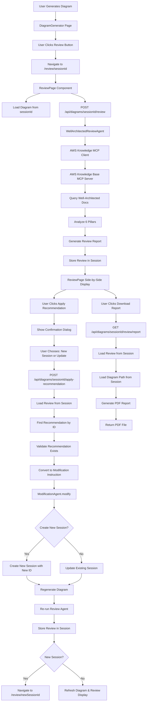

# Well-Architected Review Feature - Fixed Implementation Flow

## Overview

Add a Well-Architected Review feature that analyzes generated AWS architecture diagrams against AWS best practices. The review is displayed on a separate page (`/review/:sessionId`) with the diagram and review side-by-side. Users can apply individual recommendations to improve their architecture and download the review report as PDF.

## Architecture Flow (Corrected)



## Backend Implementation

### 1. Extend Session Storage Structure

**File**: `backend/src/api/routes.py`

- Update `current_specs` dictionary structure to include review and diagram path:
```python
current_specs: dict[str, dict] = {}
# Format: {
#   session_id: {
#     "spec": ArchitectureSpec,
#     "review": Optional[WellArchitectedReview],  # ADDED
#     "diagram_path": Optional[str],  # ADDED (absolute path)
#     "diagram_url": Optional[str],  # ADDED (relative URL)
#     "created_at": float,
#     "last_accessed": float,
#     "generation_id": str
#   }
# }
```

- Update `_update_session_spec()` to handle new fields
- Add `_store_review_in_session(session_id: str, review: WellArchitectedReview)`
- Add `_get_review_from_session(session_id: str) -> Optional[WellArchitectedReview]`
- Add `_store_diagram_info(session_id: str, diagram_path: str, diagram_url: str)`

### 2. Create AWS Knowledge MCP Client

**File**: `backend/src/integrations/aws_knowledge_mcp_client.py`

- Extend `MCPDiagramClient` pattern (reuse existing MCP protocol implementation)
- Override server command: `uvx fastmcp run https://knowledge-mcp.global.api.aws`
- Add method `query_knowledge_base(query, knowledge_base_ids, max_results)`
- Add method `search_documentation(query, max_results)` for alternative tool
- Enable via `USE_AWS_KB_MCP_SERVER` environment variable
- Global client instance pattern (like `get_mcp_client()`)

### 3. Create MCP Tool Functions

**File**: `backend/src/agents/aws_knowledge_mcp_tools.py`

- `query_aws_well_architected(query, pillar, component_types, max_results)` - Main tool for agent
- `search_aws_documentation(query, max_results)` - Alternative search tool
- Auto-enhance queries to include "AWS Well-Architected Framework" prefix
- Log all queries for debugging
- Return structured results with references and summaries

### 4. Create Review Models

**File**: `backend/src/models/well_architected_review.py`

- `WellArchitectedReview` - Main review response model
  - `overall_score: int` (0-100)
  - `pillars: List[PillarReview]`
  - `summary: ReviewSummary`
  - `reviewed_at: datetime`
- `PillarReview` - Individual pillar analysis
  - `pillar_name: str` (Security, Reliability, etc.)
  - `score: int` (0-100)
  - `issues: List[Issue]`
- `Issue` - Issue with severity, component reference, recommendations
  - `id: str` (e.g., "sec_001")
  - `severity: Literal["critical", "high", "medium", "low"]`
  - `title: str`
  - `description: str`
  - `component_ids: List[str]` - References to ArchitectureSpec components
  - `recommendations: List[Recommendation]`
- `Recommendation` - Actionable recommendation with priority
  - `id: str` (e.g., "sec_001_rec_1") - REQUIRED for lookup
  - `title: str`
  - `description: str`
  - `priority: Literal["critical", "high", "medium", "low"]`
  - `action: str` - Natural language action description
  - `aws_doc_url: Optional[str]` - Link to AWS documentation
- Use Pydantic models for validation

### 5. Create Review Agent

**File**: `backend/src/agents/well_architected_review_agent.py`

- Use Strands Agent with Bedrock model (same as DiagramAgent)
- Structured output: `WellArchitectedReview`
- System prompt instructs agent to:
  - Use `query_aws_well_architected()` tool for each pillar
  - Always include "AWS Well-Architected Framework" in queries
  - Query multiple times per pillar for comprehensive coverage
  - Compare architecture against documentation results
  - Generate issues and recommendations with AWS doc links
  - Assign unique IDs to recommendations (format: `{pillar}_{issue_id}_rec_{index}`)
- Make MCP tools available to agent via `tools` parameter
- Method `review(spec: ArchitectureSpec) -> WellArchitectedReview`

### 6. Create Recommendation Lookup Helper

**File**: `backend/src/services/recommendation_applier.py`

- `find_recommendation_by_id(review: WellArchitectedReview, recommendation_id: str) -> Optional[Recommendation]`
  - Searches through all pillars, issues, and recommendations
  - Returns None if not found
- `validate_recommendation_exists(review: WellArchitectedReview, recommendation_id: str) -> bool`
  - Validates recommendation belongs to current review
  - Raises ValueError if not found

### 7. Create API Endpoint - Review

**File**: `backend/src/api/routes.py`

- Add endpoint: `POST /api/diagrams/{session_id}/review`
- Load `ArchitectureSpec` from session storage
- Validate provider is AWS (only AWS supported initially)
- Call `WellArchitectedReviewAgent.review(spec)`
- Store review in session using `_store_review_in_session()`
- Return `WellArchitectedReview` response
- Handle errors gracefully (return 404 if session expired, 400 if not AWS)

### 8. Create API Endpoint - Diagram Info

**File**: `backend/src/api/routes.py`

- Add endpoint: `GET /api/diagrams/{session_id}/info`
- Response model: `DiagramInfoResponse`:
```python
class DiagramInfoResponse(BaseModel):
    title: str
    provider: str
    diagram_url: str
    session_id: str
    generation_id: str
    created_at: float
```
- Returns diagram metadata for review page
- Used to load diagram image on review page

### 9. Create API Endpoint - Apply Recommendation

**File**: `backend/src/api/routes.py`

- Add endpoint: `POST /api/diagrams/{session_id}/apply-recommendation`
- Request model: `ApplyRecommendationRequest`:
```python
class ApplyRecommendationRequest(BaseModel):
    recommendation_id: str
    create_new_session: bool
```
- Load current `ArchitectureSpec` from session
- Load review from session using `_get_review_from_session()`
- Validate review exists (404 if not found)
- Find recommendation by ID using `find_recommendation_by_id()`
- Validate recommendation exists (400 if not found)
- Convert recommendation to modification instruction using `convert_recommendation_to_modification()`
- Determine session_id for ModificationAgent:
  - If `create_new_session=True`: Generate new `session_id`
  - If `create_new_session=False`: Use existing `session_id`
- Call `ModificationAgent.modify(new_or_existing_session_id, current_spec, modification)`
- If `create_new_session=True`: 
  - Create new session with updated spec
  - Store diagram_path and diagram_url in new session
- If `create_new_session=False`: 
  - Update existing session with updated spec
  - Update diagram_path and diagram_url in existing session
- Regenerate diagram using `UniversalGenerator.generate()`
- Store diagram_path and diagram_url in session
- Re-run `WellArchitectedReviewAgent.review()` on updated spec
- Store new review in session
- Return `GenerateDiagramResponse` with updated diagram URL and session_id

### 10. Recommendation to Modification Converter

**File**: `backend/src/services/recommendation_applier.py`

- `convert_recommendation_to_modification(recommendation: Recommendation, spec: ArchitectureSpec) -> str`
- Converts structured recommendation into natural language modification instruction
- Handles different recommendation types:
  - "Add component X" → "Add [component] and connect to [related components]"
  - "Enable feature Y" → "Add [component] to enable [feature]"
  - "Configure Z" → "Update [component] configuration"
- Uses component context from spec to generate appropriate modifications
- Returns natural language string for ModificationAgent
- Error handling: Raises ValueError if conversion fails

### 11. PDF Report Generation

**File**: `backend/src/services/report_generator.py`

- `generate_pdf_report(review: WellArchitectedReview, diagram_path: str, diagram_title: str) -> bytes`
- Use library `reportlab` for PDF generation (more reliable than weasyprint for images)
- Include:
  - Cover page with diagram title and overall score
  - Executive summary
  - Diagram image (load from `diagram_path` - absolute path)
  - Detailed pillar analysis
  - Issues with severity
  - Recommendations with AWS doc links
  - Appendix with AWS documentation references
- Error handling: Raises ValueError if diagram_path doesn't exist or PDF generation fails
- Return PDF bytes

### 12. Report Download Endpoint

**File**: `backend/src/api/routes.py`

- Add endpoint: `GET /api/diagrams/{session_id}/review/report`
- Load review from session using `_get_review_from_session()`
- If review not found: Return 404 or trigger new review (user choice - recommend 404)
- Load diagram_path from session
- Load diagram title from ArchitectureSpec
- Call `generate_pdf_report(review, diagram_path, title)`
- Return PDF file with `Content-Type: application/pdf`
- Filename: `well-architected-review-{session_id}.pdf`
- Error handling: Return 404 if session expired, 500 if PDF generation fails

### 13. Add Feature Flag

**File**: `config/features.yaml`

- Add `well_architected_review.enabled: true`
- Add `well_architected_review.auto_review: false` (manual trigger initially)

## Frontend Implementation

### 14. Create React Context

**File**: `frontend/src/contexts/DiagramContext.tsx`

- Create `DiagramContext` with:
  - `sessionId`, `generationId`, `diagramUrl`, `provider`
  - Setters for each state
  - Persist `sessionId` to localStorage
- Export `useDiagram()` hook
- Wrap app with `DiagramProvider` in `main.tsx` (around Router)

### 15. Create Review Page Component

**File**: `frontend/src/pages/ReviewPage.tsx`

- Use React Router `useParams()` to get `sessionId` from URL
- Use `useNavigate()` for back navigation
- Layout: Side-by-side split view
  - Left side: Diagram display (load from sessionId)
  - Right side: Review results panel
- Fetch diagram info on mount: `GET /api/diagrams/{sessionId}/info`
- Auto-trigger review on mount (or show "Review Architecture" button)
- Loading states for both diagram and review
- Back button to return to diagram generator
- Responsive: Stack vertically on mobile
- State management:
  - `review: WellArchitectedReview | null`
  - `isLoadingReview: boolean`
  - `isApplyingRecommendation: boolean`

### 16. Create Review Results Component

**File**: `frontend/src/components/WellArchitectedReviewResults.tsx`

- Extract review display logic from ReviewPage
- Props: `review: WellArchitectedReview`, `sessionId: string`, `onApplyRecommendation: (recId: string, createNew: boolean) => void`
- Display:
  - Overall score (0-100) with status badge
  - Summary stats (total issues, critical, high, medium)
  - Collapsible pillars with scores
  - Expandable issues with severity badges
  - Recommendations with AWS doc links
  - "Apply" button for each recommendation
  - Top recommendations summary
- Color coding: green (excellent), blue (good), yellow (needs improvement), red (critical)
- Follow existing UI patterns (Tailwind CSS, similar to ErrorDisplay)

### 17. Apply Recommendation Dialog Component

**File**: `frontend/src/components/ApplyRecommendationDialog.tsx`

- Props: `open: boolean`, `recommendationTitle: string`, `onClose: () => void`, `onApply: (createNewSession: boolean) => void`
- Shows confirmation dialog:
  - Title: "Apply this recommendation?"
  - Recommendation description
  - Options: "Create New Session" or "Update Current Session"
  - Cancel button
- Handles user choice and calls `onApply` with boolean

### 18. Add API Service Functions

**File**: `frontend/src/services/api.ts`

- Add `WellArchitectedReview` interface (matches backend model)
- Add `DiagramInfoResponse` interface
- Add `reviewArchitecture(sessionId: string): Promise<WellArchitectedReview>`
- Add `getDiagramInfo(sessionId: string): Promise<DiagramInfoResponse>`
- Add `applyRecommendation(sessionId: string, recommendationId: string, createNewSession: boolean): Promise<GenerateDiagramResponse>`
- Add `downloadReviewReport(sessionId: string): Promise<Blob>`
- Handle errors with request ID tracking
- Follow existing API patterns

### 19. Apply Recommendation Flow

**File**: `frontend/src/pages/ReviewPage.tsx`

- Add `handleApplyRecommendation(recommendationId: string)` function
- Show `ApplyRecommendationDialog` when user clicks "Apply"
- On user choice:
  - Set `isApplyingRecommendation = true`
  - Call `applyRecommendation(sessionId, recommendationId, createNewSession)`
  - Show loading state: "Applying recommendation..."
- On success:
  - If `createNewSession`: Navigate to `/review/${response.session_id}`
  - If update: Refresh diagram display and re-fetch review
- Show success message: "Recommendation applied successfully"
- Handle errors gracefully with error display

### 20. Download Report Button

**File**: `frontend/src/pages/ReviewPage.tsx`

- Add "Download Report" button in header
- Button calls `downloadReviewReport(sessionId)`
- Show loading state: "Generating PDF report..."
- On success: Trigger browser download
- Create download link from blob:
```typescript
const url = window.URL.createObjectURL(blob)
const a = document.createElement('a')
a.href = url
a.download = `well-architected-review-${sessionId}.pdf`
a.click()
window.URL.revokeObjectURL(url)
```
- Handle errors gracefully

### 21. Add Review Button to DiagramGenerator

**File**: `frontend/src/components/DiagramGenerator.tsx`

- Add "Review Architecture" button (only show for AWS provider)
- Button appears after diagram is generated
- Use React Router `useNavigate()` to navigate to `/review/{sessionId}`
- Button styling matches existing buttons (Download, Copy, Present)
- Icon: Shield/Checkmark icon

### 22. Add Route to App

**File**: `frontend/src/App.tsx`

- Add route: `<Route path="/review/:sessionId" element={<ReviewPage />} />`
- Import `ReviewPage` component
- Import `DiagramProvider` and wrap Router with it

## Configuration

### 23. Environment Variables

**File**: `.env` or `config/env.yaml`

- `USE_AWS_KB_MCP_SERVER=true` (enable MCP client)
- `AWS_KB_MCP_SERVER_COMMAND=uvx fastmcp run https://knowledge-mcp.global.api.aws`

### 24. Dependencies

**File**: `backend/requirements.txt`

- Add `reportlab>=4.0.0` for PDF generation

## Error Handling

### Backend Error Handling

- **Session not found**: Return 404 with clear message
- **Review not found**: Return 404, suggest triggering new review
- **Recommendation not found**: Return 400 with message "Recommendation ID not found in current review"
- **ModificationAgent failure**: Return 500 with error details
- **PDF generation failure**: Return 500 with error details
- **Diagram regeneration failure**: Return 500 with error details
- **Provider not AWS**: Return 400 with message "Well-Architected Review only available for AWS architectures"

### Frontend Error Handling

- Display user-friendly error messages
- Show request ID for debugging
- Provide retry options where appropriate
- Handle network errors gracefully

## Testing Strategy

- Unit tests for recommendation lookup function
- Unit tests for recommendation-to-modification converter
- Unit tests for PDF report generation
- Unit tests for session storage helpers
- Integration tests for apply-recommendation endpoint
- Integration tests for report download endpoint
- Frontend tests for apply recommendation flow
- Frontend tests for report download
- E2E test: Apply recommendation → verify diagram updates → verify review updates
- E2E test: Download report → verify PDF structure
- E2E test: Create new session → verify navigation works

## Implementation Order

1. Extend session storage structure (critical foundation)
2. Backend MCP client and tools
3. Review models (with Recommendation.id field)
4. Review Agent
5. Recommendation lookup helper
6. Review API endpoint (store review in session)
7. Diagram Info endpoint
8. Apply recommendation endpoint (with proper session handling)
9. Recommendation-to-modification converter
10. PDF report generator (with diagram_path handling)
11. Report download endpoint
12. Frontend Context
13. Review Page component
14. Review Results component with Apply buttons
15. Apply Recommendation Dialog component
16. Apply recommendation API function
17. Download report API function
18. Apply recommendation flow in ReviewPage
19. Download button in ReviewPage
20. Review button in DiagramGenerator
21. Route configuration
22. Integration and testing

## Success Criteria

- Review stored in session and retrievable
- Recommendations have unique IDs and are lookup-able
- Applying recommendations works for both new and existing sessions
- ModificationAgent uses correct session_id
- Review automatically re-runs after applying recommendations
- Navigation works correctly (new session → review page, update → stay on page)
- PDF reports generate successfully with embedded diagram images
- All error cases handled gracefully
- Session storage includes all required fields
- End-to-end flow works without issues

## Fixed Issues Summary

1. ✅ Review storage added to session
2. ✅ Recommendation ID lookup implemented
3. ✅ Diagram path stored alongside URL
4. ✅ ModificationAgent session_id handling fixed
5. ✅ Review re-execution after applying recommendations
6. ✅ Navigation clarified (new session → review page)
7. ✅ PDF generation uses absolute diagram_path
8. ✅ Comprehensive error handling added
9. ✅ Recommendation model includes id field
10. ✅ DiagramInfo endpoint fully specified
11. ✅ Flow order corrected (user choice before ModificationAgent)
12. ✅ Recommendation validation added