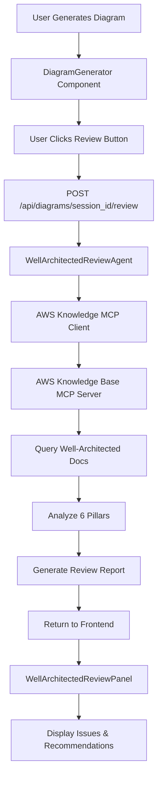

# Well-Architected Review Feature Implementation Plan

## Overview

Add a Well-Architected Review feature that analyzes generated AWS architecture diagrams against the AWS Well-Architected Framework's six pillars (Security, Reliability, Performance Efficiency, Cost Optimization, Operational Excellence, Sustainability). The feature uses AWS Knowledge Base MCP server to query authoritative AWS documentation and provides actionable recommendations.

## Architecture

## Backend Implementation

### 1. Create AWS Knowledge MCP Client

**File**: `backend/src/integrations/aws_knowledge_mcp_client.py`

- Extend `MCPDiagramClient` pattern (reuse existing MCP protocol implementation)
- Override server command: `uvx fastmcp run https://knowledge-mcp.global.api.aws`
- Add method `query_knowledge_base(query, knowledge_base_ids, max_results)`
- Add method `search_documentation(query, max_results)` for alternative tool
- Enable via `USE_AWS_KB_MCP_SERVER` environment variable
- Global client instance pattern (like `get_mcp_client()`)

### 2. Create MCP Tool Functions

**File**: `backend/src/agents/aws_knowledge_mcp_tools.py`

- `query_aws_well_architected(query, pillar, component_types, max_results)` - Main tool for agent
- `search_aws_documentation(query, max_results)` - Alternative search tool
- Auto-enhance queries to include "AWS Well-Architected Framework" prefix
- Log all queries for debugging
- Return structured results with references and summaries

### 3. Create Review Models

**File**: `backend/src/models/well_architected_review.py`

- `WellArchitectedReview` - Main review response model
- `PillarReview` - Individual pillar analysis
- `Issue` - Issue with severity, component reference, recommendations
- `Recommendation` - Actionable recommendation with priority
- Use Pydantic models for validation

### 4. Create Review Agent

**File**: `backend/src/agents/well_architected_review_agent.py`

- Use Strands Agent with Bedrock model (same as DiagramAgent)
- Structured output: `WellArchitectedReview`
- System prompt instructs agent to:
  - Use `query_aws_well_architected()` tool for each pillar
  - Always include "AWS Well-Architected Framework" in queries
  - Query multiple times per pillar for comprehensive coverage
  - Compare architecture against documentation results
  - Generate issues and recommendations with AWS doc links
- Make MCP tools available to agent via `tools` parameter
- Method `review(spec: ArchitectureSpec) -> WellArchitectedReview`

### 5. Create API Endpoint

**File**: `backend/src/api/routes.py`

- Add endpoint: `POST /api/diagrams/{session_id}/review`
- Load `ArchitectureSpec` from session storage
- Validate provider is AWS (only AWS supported initially)
- Call `WellArchitectedReviewAgent.review(spec)`
- Return `WellArchitectedReview` response
- Handle errors gracefully (return 404 if session expired, 400 if not AWS)

### 6. Add Feature Flag

**File**: `config/features.yaml`

- Add `well_architected_review.enabled: true`
- Add `well_architected_review.auto_review: false` (manual trigger initially)

## Frontend Implementation

### 7. Create React Context

**File**: `frontend/src/contexts/DiagramContext.tsx`

- Create `DiagramContext` with:
  - `sessionId`, `generationId`, `diagramUrl`, `provider`
  - Setters for each state
  - Persist `sessionId` to localStorage
- Export `useDiagram()` hook
- Wrap app with `DiagramProvider` in `main.tsx`

### 8. Create Review Panel Component

**File**: `frontend/src/components/WellArchitectedReviewPanel.tsx`

- Use `useDiagram()` hook to get `sessionId` and `provider`
- Show only for AWS provider
- "Review Architecture" button triggers API call
- Loading state with progress indicators
- Display:
  - Overall score (0-100) with status badge
  - Summary stats (total issues, critical, high, medium)
  - Collapsible pillars with scores
  - Expandable issues with severity badges
  - Recommendations with AWS doc links
  - Top recommendations summary
- Color coding: green (excellent), blue (good), yellow (needs improvement), red (critical)
- Follow existing UI patterns (Tailwind CSS, similar to ErrorDisplay)

### 9. Add API Service Function

**File**: `frontend/src/services/api.ts`

- Add `WellArchitectedReview` interface (matches backend model)
- Add `reviewArchitecture(sessionId: string): Promise<WellArchitectedReview>`
- Handle errors with request ID tracking
- Follow existing API patterns

### 10. Integrate into DiagramGenerator

**File**: `frontend/src/components/DiagramGenerator.tsx`

- Import `WellArchitectedReviewPanel`
- Import `DiagramProvider` and wrap component tree
- Replace local state with `useDiagram()` hook where appropriate
- Render `WellArchitectedReviewPanel` after diagram display
- Pass `sessionId` and `provider` via context (no props needed)

## Configuration

### 11. Environment Variables

**File**: `.env` or `config/env.yaml`

- `USE_AWS_KB_MCP_SERVER=true` (enable MCP client)
- `AWS_KB_MCP_SERVER_COMMAND=uvx fastmcp run https://knowledge-mcp.global.api.aws`

## Testing Strategy

- Unit tests for MCP client (mock MCP server responses)
- Unit tests for review agent (mock MCP tool calls)
- Integration tests for API endpoint
- Frontend component tests (mock API responses)
- Manual testing with real AWS architectures

## Implementation Order

1. Backend MCP client and tools (reuses existing patterns)
2. Review models and agent (core logic)
3. API endpoint (expose functionality)
4. Frontend Context (state management)
5. Review Panel component (UI)
6. Integration and testing

## Success Criteria

- Review endpoint returns structured analysis for AWS architectures
- Agent queries AWS Well-Architected Framework documentation via MCP
- Frontend displays review results with actionable recommendations
- Session persistence works across page refreshes
- Feature can be enabled/disabled via feature flag
- Minimal code changes (reuses existing patterns)

## Future Enhancements

- Auto-review after diagram generation (if feature flag enabled)
- Visual indicators on diagram components with issues
- Export review report (PDF/JSON)
- Multi-cloud support (Azure/GCP Well-Architected Frameworks)
- Review history tracking
- Comparison mode (compare two architectures)